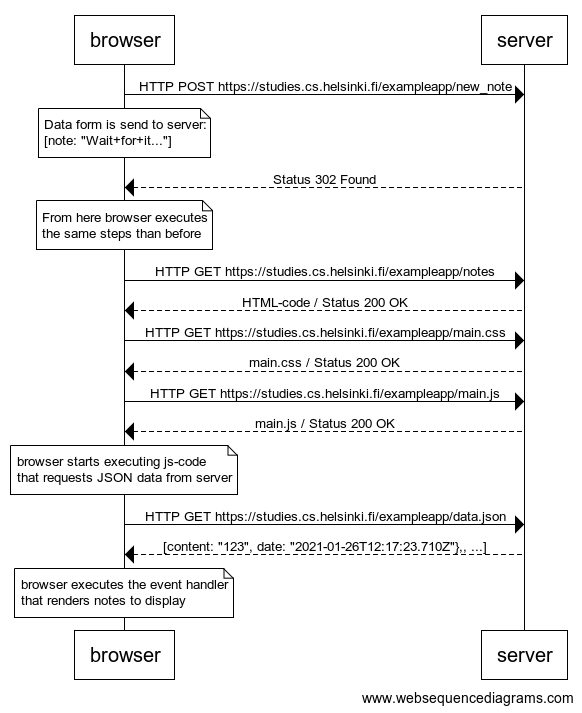

**0.4: new note**

Create a similar diagram depicting the situation where the user creates a new note on page https://studies.cs.helsinki.fi/exampleapp/notes by writing something into the text field and clicking the submit button. 

Solution:


The diagram was made using [websequencediagrams](https://www.websequencediagrams.com/) service as follows: 

```
browser->server: HTTP POST https://studies.cs.helsinki.fi/exampleapp/new_note 
note over browser:
Data form is send to server:
[note: "Wait+for+it..."]
end note
server-->browser: Status 302 Found

note over browser:
From here browser executes 
the same steps than before
end note

browser->server: HTTP GET https://studies.cs.helsinki.fi/exampleapp/notes
server-->browser: HTML-code / Status 200 OK
browser->server: HTTP GET https://studies.cs.helsinki.fi/exampleapp/main.css
server-->browser: main.css / Status 200 OK
browser->server: HTTP GET https://studies.cs.helsinki.fi/exampleapp/main.js
server-->browser: main.js / Status 200 OK

note over browser:
browser starts executing js-code
that requests JSON data from server 
end note

browser->server: HTTP GET https://studies.cs.helsinki.fi/exampleapp/data.json
server-->browser: [content: "123", date: "2021-01-26T12:17:23.710Z"},, ...]

note over browser:
browser executes the event handler
that renders notes to display
end note
```