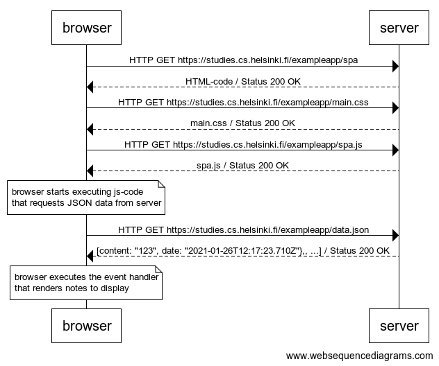

**0.5: Single page app**

Create a diagram depicting the situation where the user goes to the single page app version of the notes app at https://studies.cs.helsinki.fi/exampleapp/spa.

Solution:


The diagram was made using [websequencediagrams](https://www.websequencediagrams.com/) service as follows: 

```
browser->server: HTTP GET https://studies.cs.helsinki.fi/exampleapp/spa
server-->browser: HTML-code / Status 200 OK
browser->server: HTTP GET https://studies.cs.helsinki.fi/exampleapp/main.css
server-->browser: main.css / Status 200 OK
browser->server: HTTP GET https://studies.cs.helsinki.fi/exampleapp/spa.js
server-->browser: spa.js / Status 200 OK

note over browser:
browser starts executing js-code
that requests JSON data from server 
end note

browser->server: HTTP GET https://studies.cs.helsinki.fi/exampleapp/data.json
server-->browser: [content: "123", date: "2021-01-26T12:17:23.710Z"},, ...] / Status 200 OK

note over browser:
browser executes the event handler
that renders notes to display
end note
```