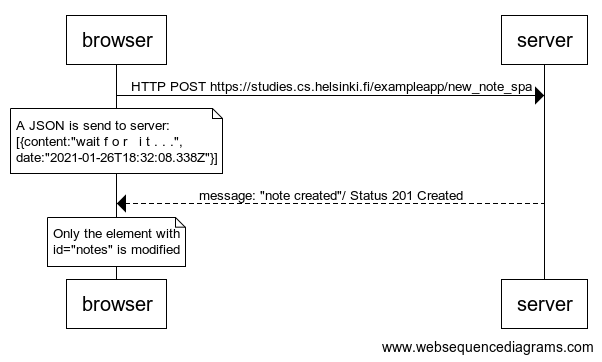

**0.6: New note**

Create a diagram depicting the situation where the user creates a new note using the single page version of the app.

This was the last exercise, and it's time to push your answers to GitHub and mark the exercises as done in the [submission application](https://studies.cs.helsinki.fi/stats/courses/fullstackopen).

Solution:


The diagram was made using [websequencediagrams](https://www.websequencediagrams.com/) service as follows: 

```
browser->server: HTTP POST https://studies.cs.helsinki.fi/exampleapp/new_note_spa 
note over browser:
A JSON is send to server:
[{content:"wait f o r   i t . . .",
date:"2021-01-26T18:32:08.338Z"}]
end note
server-->browser: message: "note created"/ Status 201 Created

note over browser:
Only the element with 
id="notes" is modified
end note
```