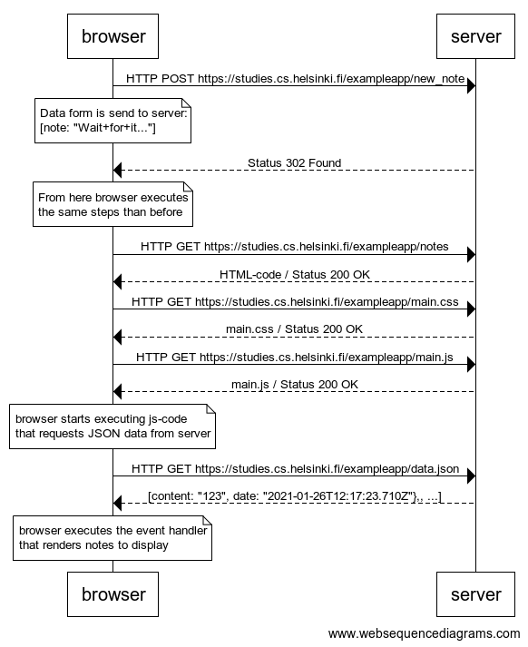
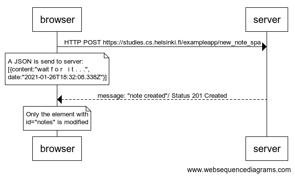

# Part 0 Fundamentals of Web apps

*The diagrams were made using [websequencediagrams](https://www.websequencediagrams.com/) service.*

## 0.4: new note

Create a similar diagram depicting the situation where the user creates a new note on page https://studies.cs.helsinki.fi/exampleapp/notes by writing something into the text field and clicking the submit button. 

Solution:
 

```
browser->server: HTTP POST https://studies.cs.helsinki.fi/exampleapp/new_note 
note over browser:
Data form is send to server:
[note: "Wait+for+it..."]
end note
server-->browser: Status 302 Found

note over browser:
From here browser executes 
the same steps than before
end note

browser->server: HTTP GET https://studies.cs.helsinki.fi/exampleapp/notes
server-->browser: HTML-code / Status 200 OK
browser->server: HTTP GET https://studies.cs.helsinki.fi/exampleapp/main.css
server-->browser: main.css / Status 200 OK
browser->server: HTTP GET https://studies.cs.helsinki.fi/exampleapp/main.js
server-->browser: main.js / Status 200 OK

note over browser:
browser starts executing js-code
that requests JSON data from server 
end note

browser->server: HTTP GET https://studies.cs.helsinki.fi/exampleapp/data.json
server-->browser: [content: "123", date: "2021-01-26T12:17:23.710Z"},, ...]

note over browser:
browser executes the event handler
that renders notes to display
end note
```

## 0.5: Single page app

Create a diagram depicting the situation where the user goes to the single page app version of the notes app at https://studies.cs.helsinki.fi/exampleapp/spa.

Solution:


```
browser->server: HTTP GET https://studies.cs.helsinki.fi/exampleapp/spa
server-->browser: HTML-code / Status 200 OK
browser->server: HTTP GET https://studies.cs.helsinki.fi/exampleapp/main.css
server-->browser: main.css / Status 200 OK
browser->server: HTTP GET https://studies.cs.helsinki.fi/exampleapp/spa.js
server-->browser: spa.js / Status 200 OK

note over browser:
browser starts executing js-code
that requests JSON data from server 
end note

browser->server: HTTP GET https://studies.cs.helsinki.fi/exampleapp/data.json
server-->browser: [content: "123", date: "2021-01-26T12:17:23.710Z"},, ...] / Status 200 OK

note over browser:
browser executes the event handler
that renders notes to display
end note
```

## 0.6: New note

Create a diagram depicting the situation where the user creates a new note using the single page version of the app.

This was the last exercise, and it's time to push your answers to GitHub and mark the exercises as done in the [submission application](https://studies.cs.helsinki.fi/stats/courses/fullstackopen).

Solution:



```
browser->server: HTTP POST https://studies.cs.helsinki.fi/exampleapp/new_note_spa 
note over browser:
A JSON is send to server:
[{content:"wait f o r   i t . . .",
date:"2021-01-26T18:32:08.338Z"}]
end note
server-->browser: message: "note created"/ Status 201 Created

note over browser:
Only the element with 
id="notes" is modified
end note
```